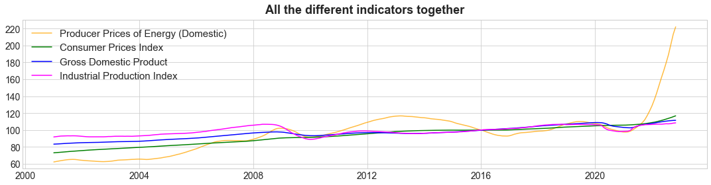
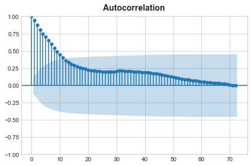

# Pricing-Predictions-on-Energy
**Predictions on producer energy prices across European Union countries**.

# Business Understanding
The highest increase in industrial producer prices in the euro area was recorded in the energy sector in 2022. Producer energy prices are an early indication of trends in consumer prices, which the European Central Bank want to keep at 2.0% in the medium term. Energy is the most relevant component of rising consumer prices, accounting for almost half of total headline inflation *(Pasimeni, 2022)*.

Energy producer prices affect household energy and non-energy prices *(Barnett et al., 2019)*. An energy producer's increase in the price by 1% over 12 months caused, household energy prices going up by 0.4% and household non-energy prices also going up by 0.04%, on average in the euro area for 2000-2022 *(Darvas et al., 2022)*. Thus, producer energy price is a predictor of what may show up in the economy in the coming months.

Current energy crisis has stoked inflationary pressures and created a looming risk of recession, as well as a huge USD 2 trillion windfall for fossil fuel producers above their 2021 net income. Faced with energy shortfalls and high prices, governments have so far committed well over USD 500 billion, mainly in advanced economies, to shield consumers from the immediate impacts *(IEA, 2022)*.

After all the aforesaid, the objective of this project is to predict producer energy prices in the EU, to provide some light on how the European economy will be in the future.

# Data preparation and understanding
We concentrate the analysis on the data of the energy sector from the **27 European Union (EU) countries** during **the 2000-2022 period**, analysing monthly information.

We use the following data based on the principles of cause and effect:
* **Producer prices of energy for the 27 EU countries (EU27_2020)** (energy producer prices): producer prices are also known as output prices. We use the domestic output price for the energy sector, which measures the average price development of all goods and related services resulting from that sector and sold on the domestic market. We look for the statistical classification of the energy sector in the European Community (NACE Rev. 2), which is defined by the energy main industrial grouping (MIG_NRG). **Producer prices come from [Eurostat](https://ec.europa.eu/eurostat/databrowser/view/sts_inppd_m/default/table?lang=en)**.
* **Producer prices of energy for each of the 27 EU countries**: data info same as before.  
* **Harmonised index of consumer prices for the 27 EU countries** (consumer price): it is an economic indicator that measures the change over time of the prices of consumer goods and services acquired by households. **Harmonised index of consumer prices come from [Eurostat](https://ec.europa.eu/eurostat/databrowser/view/EI_CPHI_M__custom_4287569/default/table?lang=en)**. 
* **Industrial production index** (industrial production): it shows the output and activity of the industry sector. It measures changes in the volume of output monthly. **Industrial production index comes from [Eurostat](https://ec.europa.eu/eurostat/databrowser/view/STS_INPR_M__custom_4288019/default/table?lang=en)**.
* **GDP and main components (output, expenditure and income)**: it provides an overall picture of the economic situation and are widely used for economic analysis and forecasting, policy design and policy making. **GDP and main components come from [Eurostat](https://ec.europa.eu/eurostat/databrowser/view/NAMQ_10_GDP__custom_4287774/default/table)**.

Concerning data collection and cleaning, data was loaded from the sources listed above. Outliers were controlled but not deemed to be eliminated. Imputations were only performed on the GDP based on a linear regression, as it was provided quarterly. The data values were controlled, they were in adequate ranges.

We observe producer prices of energy presents higher volatility compared with the other indicators. It exists correlation among energy producer prices and consumer prices (0.89), and energy producer prices and GDP (0.81). 

Energy producer prices affect consumer prices and GDP. An energy producer's increase in the price by 1% promoted, consumer prices going up by 0.27% and GDP also going up by 0.17%, on average in the euro area for 2000-2022. We can observe a lagged effect among the different indicators in the following graph.

The visualization of the European energy producer prices in the 2000-2022 period reveal the highest prices are reached in 2022.

The visualization of the energy producer prices in each EU country for 2022 reveals the highest prices are reached in Denmark, Belgium, and Romania.

<table><tr>
<td>  </td>
<td>  </td>
</tr></table>

We analyse if time series (TS) are stationary using Augmented Dickey-Fuller (ADF) and Hurst’s exponent test. These tests indicate TS are most likely non-stationary. We detrend energy producer prices by differencing it, but non-stationary continues. 

We check the Autocorrelation Function (ACF) and Partial Autocorrelation Function (PACF) for Energy producer prices TS. We observe the presence of the trend, as the plot of the ACF shows coefficients are high for short lags, and they decrease linearly as the lag increases (an exponential drop). We do not perceive seasonality, as the plot do not display cyclical patterns (a sinusoidal).

We visualize the trend and seasonality evolution for energy producer prices TS using the Box Plot. We observe seasonality remains more or less constant, likely July and September show higher prices, and February and December lower prices. In term of the trend, we observe peaks in 2008, 2012, 2018 and 2022, which correspond with other years of price shocks. The highest energy producer prices volatility was in 2021 and 2022.

# Modelling and evaluation
We use the following models to predict producer energy prices across European Union countries.

**TIME SERIES MODELS**

* CASE 1: SARIMA (Seasonal ARIMA) Model – Univariate Modelling
* CASE 2: SARIMAX Adding external variables (X) to the SARIMA model – Multivariate Modelling

**SUPERVISED MACHINE LEARNING MODELS**

* CASE 3: Gradient Boosting with XGBoost
* CASE 4: LightGBM model
* CASE 5: Ensemble with StandardScaler, PCA and XGBRegressor

**ADVANCED MACHINE AND DEEP LEARNING MODELS**

* CASE 6: Combining CNN with Long Short-Term Memory (LSTM)
* CASE 7: Recurrent Neural Networks (RNN): SimpleRNN, GRU, and LSTM
   * CASE 7.1: RNN with one LTSM layer
   * CASE 7.2: RNN with three-layer LSTM
   * CASE 7.3: Gated Recurrent Unit (GRU) with 3 layers
   * CASE 7.4: three layers of SimpleRNN
* CASE 8: Prophet
   * CASE 8.1: Prophet without Transformation
   * CASE 8.2: Prophet with Box-Cox Transformation
* CASE 9: Amazon's DeepAR

**SARIMAX** provide the best results as the time series part is more present than the external variables part. If the external variables alone could explain a lot and this complemented by a part of autocorrelation or seasonality, supervised models might be the better choice... but this is not our case. 

We use SARIMAX with producer energy prices lag-1..lag-12 as exogenous variables. For this multivariate model, we use the auto_arima function imported from pmdarima.arima. We obtain the following metrics for our test sample: 
 
* MAE  2.1157
* MAPE 0.0151
* R2 Score 0.9836

It is important to say, our best prediction was trained with the producer energy prices for the 2001-2009 period, which include the 2008 oil shock.! The previous most disruptive oil price shocks occurred in the 2005-2008 and 2010-2014 periods:
- The first (2005-2008) shock resulted from increased demand generated by economic growth in China and India. At that time, OPEC was unable to expand production due to long-term lack of investment.
- The second (2010-2014) shock reflected the impacts of Arab Spring pro-democracy protests in the Middle East and North Africa, combined with conflict in Iraq and international sanctions that Western nations placed on Iran to slow its nuclear weapons program. Together, these events pushed oil prices above $100 per barrel for a four-year stretch – the longest such period on record. Relief finally came via a flood of new oil from shale production in the U.S.

Some important events occurred during the 2001-2009 period of our test sample:
- 2001-2003: 9/11 and invasion of Iraq raise concerns about Middle East stability: Venezuelan oil workers' strike.
- 2008: Global Financial Crisis 
- Crude oil reached an all-time high of 147.27 in July of 2008.

We also obtain good results using **Ensemble with StandardScaler, PCA and XGBRegressor**. To add seasonality to those models, you can convert the seasonality information into input variables. So, we predict the producer energy prices using as predictors producer energy prices from lag-1 to lag-12. Our hyperparameters for:
* PCA: n_components = 2
* xGBRegressor: n_estimators = 12, max_depth = 25, and learning_rate = 1

We obtain the following metrics for our test sample: 
 
* MAE  3.2783
* MAPE 0.0297
* R2 Score 0.9738

This provide us the following energy producer prices forecast for 2023:

The vertical red lines represent test and forecasted timelines.

Combining CNN with LSTM and RNN (SimpleRNN, GRU, and LSTM) have provided good results too. Whereas Prophet and Amazon's DeepAR were not suitable at all.

# Conclusion

Producer energy price is a predictor of what may show up in the economy in the coming months. Energy producer prices affect consumer prices and GDP. An energy producer increases in the price by 1% promoted, consumer prices going up by 0.27% and GDP also going up by 0.17%, on average in the euro area for 2000-2022.
We observe producer prices of energy presents substantial volatility in EU. The highest energy producer prices volatility occurred during in the years 2021 and 2022. In term of the trend, we observe the higher peak in 2022.

Concerning the best prediction models for energy producer prices in Europe,  **SARIMAX** provided the best results, as the time series part is more present than the external variables part. The **Ensemble with StandardScaler, PCA and XGBRegressor** adding seasonality with time lagging provided also good results. **The prices of energy forecast reveal that prices will decrease in 2023**.

**All this should consider the extent to which EU countries implement a strong and united policy response to the energy crisis**. A positive policy implementation would contain the direct impact of the producer energy price increase on households and firms and would stabilise inflation, reducing the need for further interest rate hikes and allowing an earlier recovery. 

# Bibliography
* *Barnett, W. A., Wang, C., Wang, X., Wu, L. 2019. What inflation measure should a currency union target?. Journal of Macroeconomics, 59: 123-139.*
* *Darvas, Z., Le Mouel, M., Tagliapietra, S., Zettelmeyer, J. 2022. How European Union energy policies could mitigate the coming recession. Bruegel. https://www.bruegel.org/blog-post/how-european-union-energy-policies-could-mitigate-coming-recession-0. Accessed 28 December 2022.*
* *International Energy Agency - IEA 2022. World Energy Outlook 2022. https://iea.blob.core.windows.net/assets/830fe099-5530-48f2-a7c1-11f35d510983/WorldEnergyOutlook2022.pdf. Accessed 30 December 2022.*
* *Pasimeni, P. 2022. Supply or Demand, that is the Question: Decomposing Euro Area Inflation. Intereconomics, 57: 384-393.*
